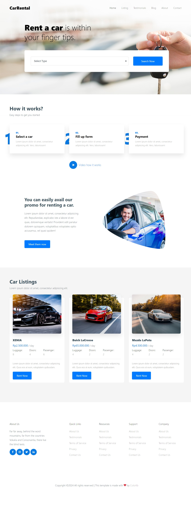

# RentalMobil Laravel

  <!-- Ganti path dan nama file sesuai dengan lokasi gambar kamu -->

### Dashboard Admin
  <!-- Ganti path dan nama file sesuai dengan lokasi gambar kamu -->

## Prerequisites

Sebelum memulai, pastikan Anda memiliki perangkat lunak berikut yang terinstal pada sistem Anda:

- PHP (minimal versi 8.0)
- Composer
- MySQL atau MariaDB (atau database lain yang Anda gunakan)
- Node.js dan NPM (jika menggunakan frontend tools)

## Instalasi

Ikuti langkah-langkah berikut untuk menginstal dan menjalankan proyek ini di lingkungan lokal Anda:

### 1. Clone Repository

Clone repository ini ke komputer lokal Anda menggunakan Git:

```bash
git clone https://github.com/username/repository-name.git
cd repository-name
```

### 2. Instal Dependensi

Instal dependensi PHP dan JavaScript:

```bash
composer install
npm install
```

### 3. Konfigurasi .env

Salin file `.env.example` menjadi file `.env`:

```bash
cp .env.example .env
```

Edit file `.env` untuk mencocokkan konfigurasi lingkungan Anda. Pastikan Anda mengatur:

- `DB_CONNECTION`
- `DB_HOST`
- `DB_PORT`
- `DB_DATABASE`
- `DB_USERNAME`
- `DB_PASSWORD`

Contoh konfigurasi untuk MySQL:

```dotenv
DB_CONNECTION=mysql
DB_HOST=127.0.0.1
DB_PORT=3306
DB_DATABASE=nama_database
DB_USERNAME=root
DB_PASSWORD=secret
```

### 4. Generate Key Aplikasi

Generate key aplikasi untuk Laravel:

```bash
php artisan key:generate
```

### 5. Migrasi dan Seed Database

Jalankan migrasi untuk membuat tabel-tabel yang diperlukan di database:

```bash
php artisan migrate
```

Jika ada seeder, jalankan juga:

```bash
php artisan db:seed
```

### 6. Jalankan Server

Jalankan server lokal menggunakan Artisan:

```bash
php artisan serve
```

Akses aplikasi di browser dengan membuka URL [http://localhost:8000](http://localhost:8000).

### 7. (Opsional) Mengelola Frontend

Jika Anda menggunakan alat frontend seperti Laravel Mix, Anda dapat menjalankan perintah berikut untuk membangun asset:

```bash
npm run dev
```

Untuk membangun asset untuk produksi:

```bash
npm run prod
```

## Struktur Proyek

Deskripsi singkat tentang struktur proyek jika perlu.

- `app/` - Kode sumber aplikasi
- `config/` - File konfigurasi aplikasi
- `database/` - Migrasi dan seeder
- `resources/` - Views dan aset frontend
- `routes/` - File rute
- `storage/` - File yang di-cache dan log
- `tests/` - Tes aplikasi

## Penggunaan

Untuk akses halaman admin 
http://127.0.0.1:8000/admin

user/email : juned@gmail.com
password : 12345

## Kontribusi

Jika Anda ingin berkontribusi pada proyek ini, silakan lihat [CONTRIBUTING.md](CONTRIBUTING.md) untuk panduan kontribusi.

## Lisensi

Deskripsi lisensi proyek. Contoh:

MIT License. Lihat [LICENSE](LICENSE) untuk detail lebih lanjut.

## Kontak
adisyahadi41@gmail.com
